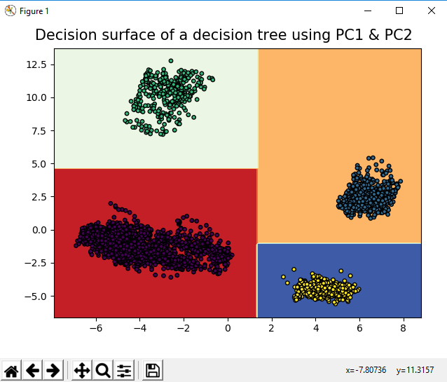
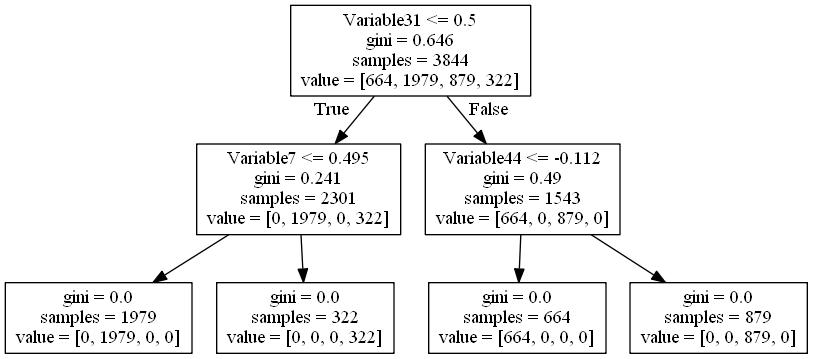
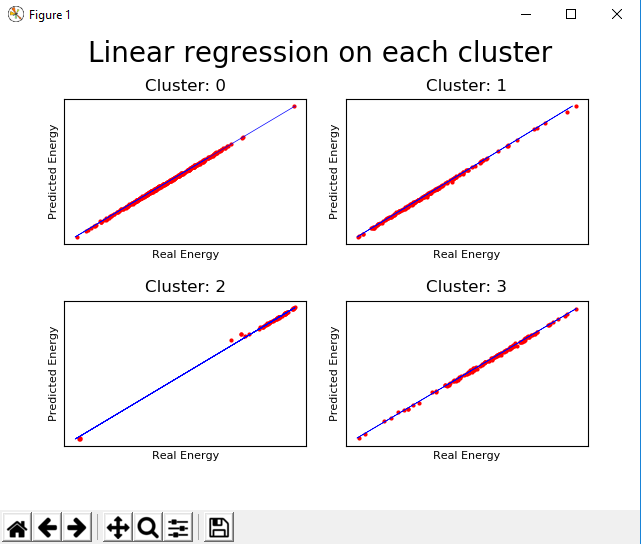

# :bomb: Energy Modeling :chart_with_upwards_trend:

This is a data mining task I've been given during my summer internship.
It consisted in the modeling of energy for different operational modes in an Oil&Gas plant.

- Used Algorithms: Kmeans, PCA, DecisionTreeClassifier, Linear Regression. 

## Overview Of The Achieved Work

 ### :pushpin: Informations About The Data

The Data is from the Oil&Gaz industry. For confidentiality reasons, the name of the plant have not been provided. 
The data is in the format of a CSV file. It’s composed of 50 columns which are: Rows Header, TimeStamp, Variable1
to Variable47 and Energy. And it has 3844 instances. Also the names of the Variable1 to Variable47 have not been given for confidentiality reasons. The data is clean, so the outliers and missing values have been removed.

### :pushpin: Data Processing

:point_right: I started by removing the Rows Header and TimeStamp columns because they are irrelevant. Then I applied PCA, as a dimentionality-reduction algorithm, it allows us to plot the data to have a better idea about it. With the visualization as shown in the figure below we can see that there are 4 groups.

   

:point_right: That’s why I applied K-means algorithm with k=4. Then I added a new column to the data that contains the number of the cluster for each instance. After that, I applied Decision Tree algorithm on the new data which results in the following figure.

   

:point_right: Finally that I have 4 clusters that actually represents 4 operational modes of the plant’s machines, I can apply the Linear Regression algorithm on each cluster to get its equation. The figure below shows the result.

   

 
 

Made with :hearts: in summer :surfer: 2018.

